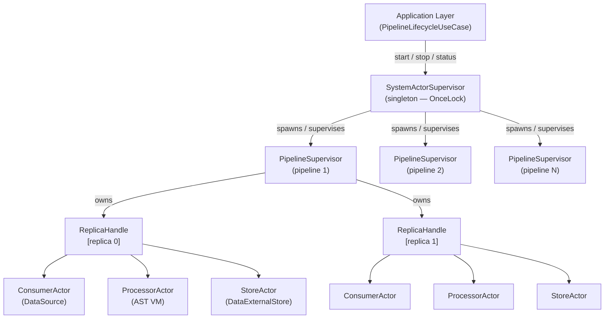
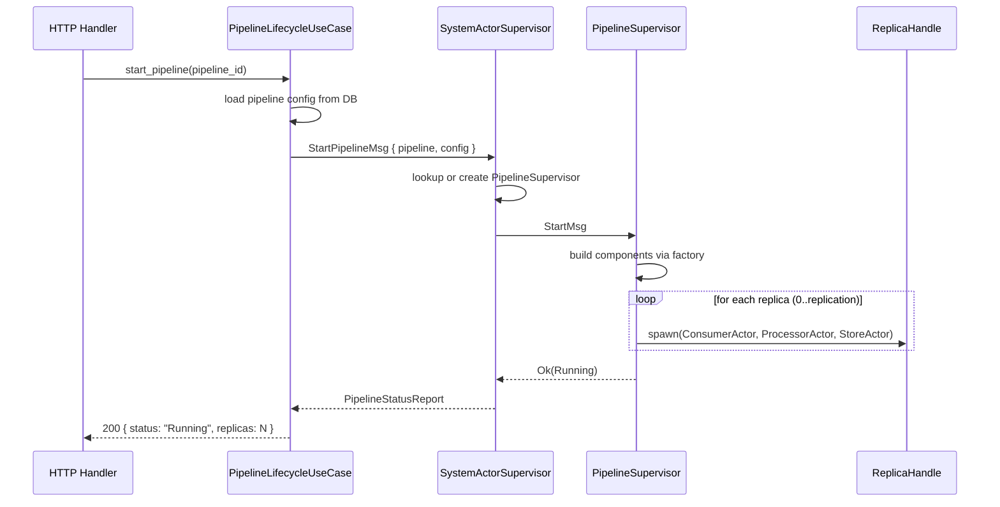

# Actor System & Pipeline Runtime

This document describes the Actix-based actor system that manages the runtime lifecycle of pipelines in iot-bee.

---

## Table of Contents

- [Overview](#overview)
- [Actor Hierarchy](#actor-hierarchy)
- [Actor Responsibilities](#actor-responsibilities)
- [Message Flow](#message-flow)
- [Data Flow Inside a Replica](#data-flow-inside-a-replica)
- [Pipeline Lifecycle](#pipeline-lifecycle)
- [Status Reporting](#status-reporting)
- [Source Files](#source-files)

---

## Overview

iot-bee uses the [Actix](https://actix.rs/) actor framework to run pipelines concurrently. Each running pipeline is managed by a dedicated supervisor actor that owns one or more **replicas** — independent workers that each consume from the data source, process data via the AST-based validation VM, and write results to the external store.

The actor system is the implementation of the `PipelineLifecycle` domain port. The HTTP handlers never interact with actors directly; they go through application-layer use cases that call this trait.

---

## Actor Hierarchy



There is exactly **one** `SystemActorSupervisor` per process, created at startup and stored in a `OnceLock<Addr<SystemActorSupervisor>>`. All pipeline operations go through this singleton.

---

## Actor Responsibilities

| Actor | Role |
|---|---|
| `SystemActorSupervisor` | Global registry of pipeline supervisors. Routes start/stop/status messages to the correct `PipelineSupervisor`. Creates supervisors on first start. |
| `PipelineSupervisor` | Owns the full set of replicas for one pipeline. Spawns `ReplicaHandle`s on start. Stops/drops them on stop. Reports aggregate status. |
| `ReplicaHandle` | Wraps the three async tasks (consumer → processor → store) for a single worker. Uses Tokio `JoinHandle`s and MPSC channels to wire them together. |
| `ConsumerActor` | Connects to the data source (RabbitMQ / MQTT / Kafka) and forwards raw messages downstream over an MPSC channel. |
| `ProcessorActor` | Reads raw messages, parses JSON, runs fields through the compiled schema (AST bytecode VM), and forwards processed `HashMap<String, Value>` downstream. |
| `StoreActor` | Reads processed records and writes them to the external store (InfluxDB / local log file). Handles connection and write errors in isolation. |

---

## Message Flow

The following diagram shows the sequence for starting a pipeline through the API:



The stop flow mirrors the start flow: `StopPipelineMsg` →  `PipelineSupervisor` drops all `ReplicaHandle`s, joining the Tokio tasks.

---

## Data Flow Inside a Replica

Each replica is three linked async tasks connected by bounded MPSC channels:

```
  ┌─────────────────┐  channel 1   ┌──────────────────┐  channel 2   ┌────────────────┐
  │  ConsumerActor  │ ──────────► │  ProcessorActor  │ ──────────► │   StoreActor   │
  │                 │             │                  │             │                │
  │  RabbitMQ/MQTT/ │             │  parse JSON      │             │  InfluxDB      │
  │  Kafka consumer │             │  validate fields  │             │  LocalLog      │
  │                 │             │  apply transforms │             │                │
  └─────────────────┘             └──────────────────┘             └────────────────┘
      DataSource trait                 AST VM                    DataExternalStore trait
```

- **Channel 1** carries raw `DataConsumerRawType` (the raw message bytes/string from the broker).
- **Channel 2** carries processed `HashMap<String, serde_json::Value>` records.
- If either downstream task is slow, channel backpressure naturally throttles the consumer.
- If a task panics, the `ReplicaHandle` loses its `JoinHandle`; the supervisor can detect this via a status check.

---

## Pipeline Lifecycle

### Start

1. The use case loads the full pipeline configuration from PostgreSQL (data source config, validation schema, data store config).
2. It sends a `StartPipelineMsg` to `SystemActorSupervisor`.
3. The supervisor creates (or reuses) a `PipelineSupervisor` for that pipeline ID.
4. The supervisor uses `PipelineComponentFactory` to build:
   - A `DataSource` implementation (RabbitMQ consumer, MQTT subscriber, Kafka consumer).
   - A compiled schema (AST bytes) from the `SchemaCompiler`.
   - A `DataExternalStore` implementation (InfluxDB writer, log appender).
5. For each replica index `0..replication`, a `ReplicaHandle` is spawned.
6. Status is updated to `Running`.

### Stop

1. `StopPipelineMsg` is sent to `SystemActorSupervisor`.
2. The supervisor finds the `PipelineSupervisor` and sends it a stop message.
3. The supervisor drops all `ReplicaHandle`s, which signals all three tasks to shut down.
4. Tasks drain in-flight messages before exiting.
5. Status is updated to `Stopped`.

### Status query

`GetStatusMsg` returns a `PipelineStatusReport` without modifying any actor state.

---

## Status Reporting

`PipelineStatusReport` is the data structure returned by all lifecycle status queries:

| Field | Type | Description |
|---|---|---|
| `pipeline_id` | integer | Database ID of the pipeline |
| `pipeline_name` | string | Human-readable pipeline name |
| `status` | `PipelineStatus` | `Running`, `Stopped`, or `Error` |
| `replicas` | integer | Number of active replicas (when Running) |

The actor system never stores status in the database — status is always derived from the live actor state.  
At startup, `start_all_pipelines()` is called, which restarts all pipelines that were `Running` at the time the process last stopped (persisted state in PostgreSQL).

---

## Source Files

| File | Description |
|---|---|
| `supervisor.rs` | `SystemActorSupervisor` — singleton actor, message definitions |
| `pipeline_supervisor.rs` | `PipelineSupervisor` — per-pipeline lifecycle owner |
| `replica.rs` | `ReplicaHandle` — wires consumer + processor + store via MPSC |
| `consumer_actor.rs` | Async task wrapping a `DataSource` |
| `processor_actor.rs` | Async task running the AST VM processor |
| `store_actor.rs` | Async task wrapping a `DataExternalStore` |
| `bridge.rs` | Helper that exposes the `OnceLock` supervisor address to the application layer |
| `mod.rs` | Re-exports and module wiring |
